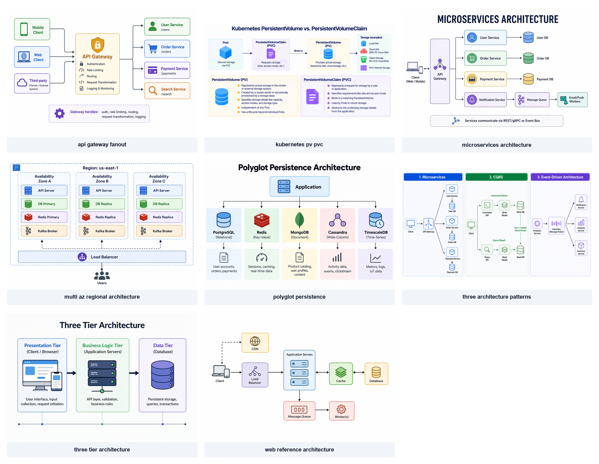
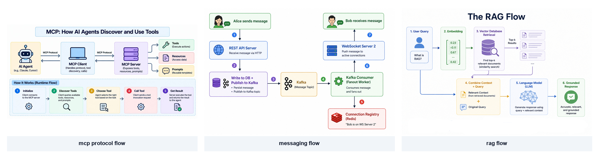
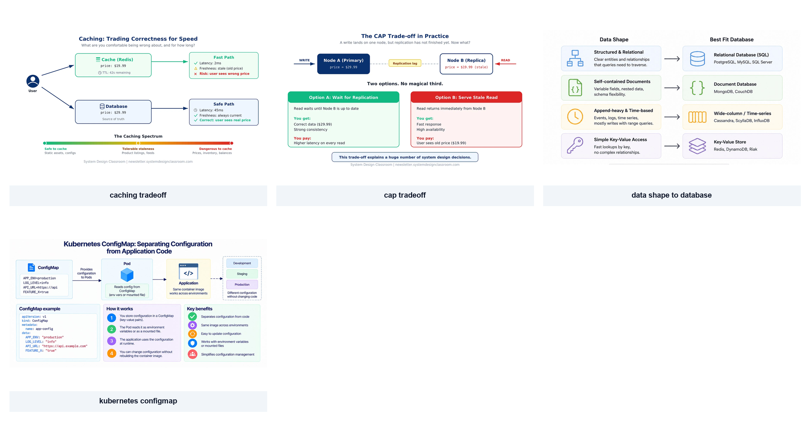
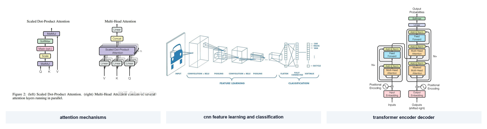

# 参考图库

按版式类型分类的参考图。生成新图时，先在此找 1-2 张结构或气质相近的图作参考，不要求复刻。

- [architecture/](architecture/) — 系统架构、层级、依赖、分区
- [flow/](flow/) — 顺序流程、数据流、协议交互
- [comparison/](comparison/) — 二元权衡、对照卡片、决策映射
- [neural-network/](neural-network/) — 深度学习架构（CNN、Transformer、Attention）

框图的默认风格品质参照见 [newsletter-style](style/newsletter-style.md)：图标底板、标题/灰色说明、内部同色浅深。优先选跨主题参考，布局仍自主设计。

原有图库的来源与借鉴清单见 [sources.json](sources.json)，本次生成的风格样例记录见 [newsletter-style.json](style/newsletter-style.json)。

## 外部参考图库

本地库之外，优先去 **[topconf-paper-figure-gallery](https://github.com/qwdwqfwq/topconf-paper-figure-gallery)** 找近年顶会的 Figure 1 / teaser 作为参考——该库收录 ICLR / ICML / NeurIPS / CVPR / ACL / AAAI 2023-2026 的首图，按 **conceptual / framework / pipeline / architecture / taxonomy / teaser** 六类打标签，可直接按版式筛选。

- 在线浏览与筛选：https://qwdwqfwq.github.io/topconf-paper-figure-gallery/
- 使用方式：挑 1-2 张结构或气质相近的图，**只借布局、分组节奏、文字层次**（见 [diagram-design §三](../references/diagram/diagram-design.md#三参考图使用方式)、[diagram-render §三](../references/diagram/diagram-render.md#三按版式用-tikz-实现)）；视觉元素（色板、字体、线型）仍按 [diagram-render §4.2](../references/diagram/diagram-render.md#42-视觉规格tikz-落地) 的 Lancet 2024-07 + 思源黑体 Normal + 霞鹜文楷落地，不复刻原图配色和装饰。
- 使用边界：仅做设计方向参考；图里的科学内容、精确标签、机制细节不作为当前任务的事实来源。注意该库图片属于原作者和出版商，72 小时下架政策下别把参考图当作可商用素材。

本地 examples/ 作为"已核验、带借鉴注记"的小而精选集，外部库作为"覆盖面广、随新论文滚动更新"的广谱底库——两者互补。

## 架构图

| 图 | 用于 | 值得借鉴 |
|---|---|---|
| [microservices-architecture](architecture/microservices-architecture.png) | 中心网关 + 多个独立服务 + 存储 | 顶部封面级大标题；网关列单独放左侧成为分支中枢；服务按色分类对应到 Border/Fill 对；底部一条虚线卡片做图例说明通信方式 |
| [three-tier-architecture](architecture/three-tier-architecture.png) | 固定层数的分层架构（3-5 层） | 三张等高卡片横向并列，内部放角色插画；卡片顶部用粗体色标题；底部一条浅色点线+彩色圆点做层级位置标记 |
| [multi-az-regional-architecture](architecture/multi-az-regional-architecture.png) | 跨机房/多可用区的高可用部署 | 外层虚线边框表示 Region 物理边界，内层虚线框表示 AZ 等逻辑分区；三个 AZ 竖向切片内保持相同组件顺序和颜色；Primary vs Replica 用标签差异化不换色 |
| [api-gateway-fanout](architecture/api-gateway-fanout.png) | 多端客户端 + 中心网关 + 多个下游服务 | 左右对称 fan-in/fan-out 结构；中心 Gateway 节点明显放大并带内部 feature bullet；下游 service 保持等高小卡片；强调节点通过放大和图标数量承担焦点，不靠加粗色 |
| [web-reference-architecture](architecture/web-reference-architecture.png) | 典型 Web 后端（LB + App + Cache/DB/Queue + CDN） | 主干水平流 + 两条垂直分支（CDN 旁路、Queue+Worker 异步）；CDN 分支用虚线表示可选；双向关系用双向箭头（Cache ⇄ Database） |
| [polyglot-persistence](architecture/polyglot-persistence.png) | 一对多扇出：一个核心对多种后端 | 单节点在顶部向下分出等宽并列列；每列由「Logo+类别」+「使用场景」两层组成；通过行对齐而非框线实现分层 |
| [three-architecture-patterns](architecture/three-architecture-patterns.png) | 几种方案并排对照（而非顺序） | 三张等宽等高面板横向并列；顶部实色标题栏（蓝/绿/紫）；编号 1/2/3 作为分类标签而非流程顺序；面板内自成完整小架构图 |
| [kubernetes-pv-pvc](architecture/kubernetes-pv-pvc.png) | 概览 + 详述组合图 | 上部一行流程图（关键关系用虚线+文字标注与常规实线区分），下部两张详细说明卡；同一张图承担概览+详述两种阅读深度 |

## 流程图

| 图 | 用于 | 值得借鉴 |
|---|---|---|
| [messaging-flow](flow/messaging-flow.png) | 多节点顺序流程 / 事件消息投递 | 彩色实心编号圆点贴在箭头上，颜色按步骤循环；节点内「图标 + 粗标题 + 两行描述」；按角色分色 |
| [mcp-protocol-flow](flow/mcp-protocol-flow.png) | 静态架构 + 运行时流程二合一 | 上下双区：上部大图标节点+双向箭头显示架构，下部用更小的编号卡横向排列显示运行时；编号圆点色与节点色一致；底部用浅色大面板包起来形成视觉分区 |
| [rag-flow](flow/rag-flow.png) | 多阶段数据流（含分支/汇合） | 两行流程中间有汇合节点；每步编号与标题直接在节点内置顶（无外置圆点）；关键"原始 Query"在步骤 4 处单独跳线补入 |

## 对照图

| 图 | 用于 | 值得借鉴 |
|---|---|---|
| [cap-tradeoff](comparison/cap-tradeoff.png) | 二元权衡 / 两个选项对比 | 顶部主标题 + 副标题提问；上部场景行；下部两张并列对比卡片，顶部色条标题（绿=推荐/红=风险）；卡内用 You get:/You pay: 二元列表；底部单行结论卡 |
| [caching-tradeoff](comparison/caching-tradeoff.png) | 并行路径对比 + spectrum | 两条平行路径，每条终点带 ✓/⚠/✗ 符号卡片；底部一条绿→黄→红 spectrum 色条 + 三组对照说明 |
| [kubernetes-configmap](comparison/kubernetes-configmap.png) | 场景 + 机制 + 优点三件套 | 顶部一行运行时视图；底部一行三栏：代码示例、编号步骤卡、好处列表（✓/图标+短句） |
| [data-shape-to-database](comparison/data-shape-to-database.png) | 决策映射：X 场景选 Y 技术 | 左列（场景）→ 中间箭头 → 右列（推荐方案），多行同样结构重复；两列用不同浅色区分但同行色相同族 |

## 神经网络图

这几张图的配色和线条和本 skill 的其他图不同；它们是领域习惯画法。读的时候只借**布局、框和连线**，不复用它们的灰白线稿或论文配色；画成品时按本 skill 的统一视觉语言（见 [diagram-design §四](../references/diagram/diagram-design.md#四视觉规格权威规格)）落地。

| 图 | 用于 | 值得借鉴 |
|---|---|---|
| [cnn-feature-learning-and-classification](neural-network/cnn-feature-learning-and-classification.png) | CNN 整体管线 | 等轴测立方体表示特征图（H/W/C 三轴）；立方体尺寸从左到右逐级缩小对应 spatial downsampling；斜线从前层投射到后层表示 Conv 感受野；操作名作为底部等宽大写标签稳定基线；底部 brace 把管线分段 |
| [transformer-encoder-decoder](neural-network/transformer-encoder-decoder.png) | Transformer 整体架构（Encoder + Decoder） | 左右两列用容器 + 外部 `N×` 标记表示重复 N 次；块按运算类型分色且色相稳定；残差连接用从模块入口外绕回到 Add&Norm 的正交线；Encoder→Decoder 的 cross-attention 用显式长桥线；⊕ 符号表示 token embedding 和 positional encoding 相加 |
| [attention-mechanisms](neural-network/attention-mechanisms.png) | 原理图 + 组件堆叠双图对照 | 两图并列同页共享色板与块样式；Q/K/V 作为底部对称输入；多头并行用错位堆叠的叠块阴影；右侧 `h` brace 标 head 数量 |

## 怎么把参考喂给图像模型

1. 判断当前图要讲什么任务：架构、流程、对照、决策、神经网络。
2. 从对应子目录打开 1-2 张结构或气质相近的原图。
3. 把原图通过工具实际支持的参考图片接口提供给模型，并说明每张图的作用。不能只在提示词里写本地路径就宣称模型看过图片。
4. 用几句话交代"借哪些设计品质"，同时给出当前内容和不可改变的事实；布局、形状、箭头风格由模型按参考综合设计。
5. 按 [diagram-review](../references/diagram/diagram-review.md) 对实际成图做比较，保留成功的设计选择，再修最明显的问题。

## 扩展图库

- 新增参考图保存到对应子目录（architecture / flow / comparison / neural-network），用描述性 kebab-case 命名。
- 重新运行 [make_contact_sheets.py](make_contact_sheets.py) 刷新每类的 contact sheet。
- 在 [sources.json](sources.json) 补一行：name / file / topic / sha256 / 原始来源 / 许可 / 借鉴说明。
- 第三方许可见 [THIRD_PARTY_LICENSES.md](THIRD_PARTY_LICENSES.md)；CC BY-NC-ND 和未声明许可的图不作重分发。
