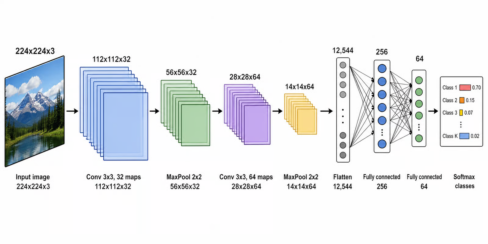
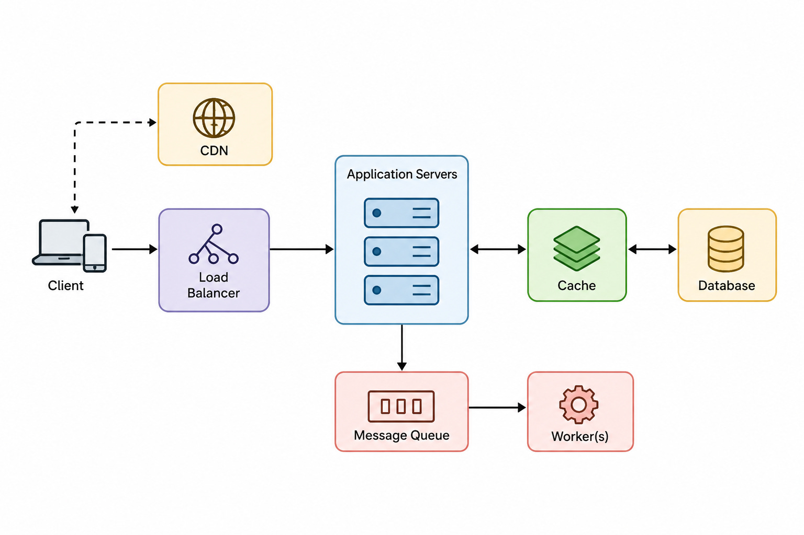
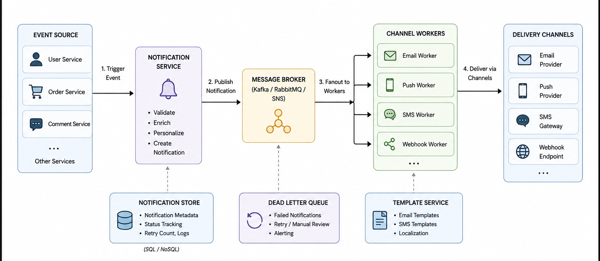

# 清晰技术示意图：当前品质参考

用户于 2026-10-09 提供多张参考，以下三张分别说明机制图元、简洁架构与分组层次，只作为共同视觉基准。实际生成时按本题内容另选 2–3 张主题、机制或对象相关且表达互补的参考，不固定使用这里三张。只借视觉表达，不复用标签、数字、算法关系或固定布局；图中内容仍需独立核实。不声称已识别原字体。

借鉴：清晰主路径、简洁投影堆叠、适度加重短标签。维度不重复在上下两处标注，示意片数不当作真实通道数；仅保留解释机制所需的尺寸。

借鉴：白底、低饱和浅底、细边框、直接融入节点的语义图标和少量准确箭头。图标不需要统一的深色徽章；无必要说明时只写名称。

借鉴：浅色分组、近白内部行、清楚的汇合与分支、辅助模块有主次。节点中的操作清单、品牌举例和步骤文字仅在回答教学问题时保留，不能照搬全部标注。

英文选择 [Inter](https://rsms.me/inter/) Regular/SemiBold，中文选择 [思源黑体 SC](https://github.com/adobe-fonts/source-han-sans) Normal（主体标签）与霞鹜文楷 Regular（必要说明），数学固定 STIX2。中文以字号与位置区分层次，不合成加粗；三类图片共用这套字体与配色。语义配色遵循现行视觉规格，不照搬参考位图的像素色值。

参考来源为用户提供的图片；原始作者和外部分发许可未提供，不声称自制或具有开放许可证。文件与 SHA-256 见 [来源记录](technical-style-sources.json)。新复杂框图必须是大模型直接生成、实际绑定字体并渲染核验的可编辑 SVG；这些 PNG 仅为风格参考。
