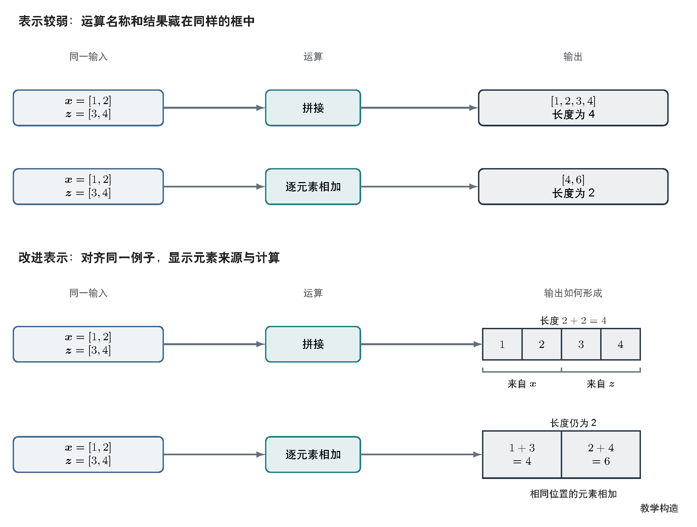
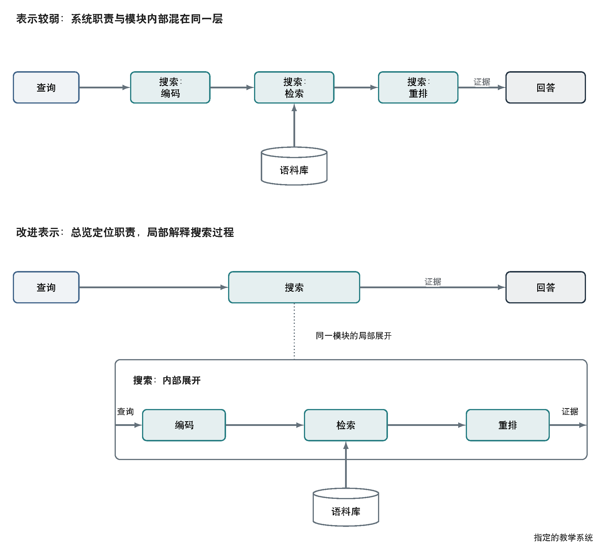
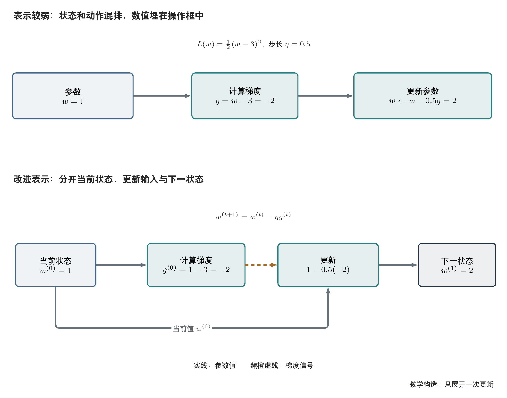

# 带解释的对照图例

按理解难点选择案例。先打开预览看实际图面，再读分析；仅阅读绘图代码无法判断图片是否讲清楚。每个案例上半部展示解释较弱的表示，下半部展示改进表示，两部分保留相同的关键事实、字号和配色。它们是原创教学构造，不是实验结果，也不是质量提升的统计证据。

这些图例保留已有 TikZ 源文件，供学习解释结构、查看实现或局部维护，不代表新图的默认工具。新的复杂架构、流程和机制示意按 [图像模型工作流](image-model-workflow.md) 生成；少量节点、单层结构、短标签和简单连线的框图才默认使用 TikZ。借用图例的解释方法即可，不必重画现有资产或沿用其工具。

## 元素怎样形成输出：拼接与逐元素相加

[可编辑源文件](examples/element-mapping.tex) · [矢量预览](examples/element-mapping.pdf)

读者已知向量，要回答“为什么拼接得到四个元素，相加仍是两个元素”。已知输入为向量 `x=[1,2]`、`z=[3,4]`，拼接为 `[1,2,3,4]`，逐元素相加为 `[4,6]`。

上图用框和运算名称给出结果，读者仍要在脑中把元素与结果对应。下图保留同一输入，按列对齐两种运算：拼接显示两段元素的来源，相加显示对应位置的计算。输出长度及形成方式一起可见。适合借用的是“同例子、同列对齐、直接展示元素对应”，不是固定使用四格向量或这两个运算。

阅读检查：能否指出拼接输出的第三项来自哪里、相加输出的第二项如何得到？该例只比较一维向量，不能据此推断任意张量轴的合法拼接条件。

## 系统职责与模块内部：总览加局部展开

[可编辑源文件](examples/overview-detail.tex) · [矢量预览](examples/overview-detail.pdf)

读者要同时知道系统中“搜索”位于哪里，以及它内部如何处理查询。教学系统的已知事实为：查询进入搜索，搜索向回答模块提供证据；搜索内部依次编码、检索、重排，语料库向检索提供数据。这是指定的示意系统，不代表所有问答系统。

上图把内部步骤和系统模块排在同一层，搜索职责只能靠重复前缀识别。下图在总览中保留完整的“搜索”模块，在独立面板展开其内部步骤；相同名称和无箭头的参考线明确二者是同一个模块。数据路径保持实线，局部展开不被误读为新的运行分支。

阅读检查：能否从查询追到回答，并指出语料库连接哪个内部步骤？能否解释总览中的搜索与下方面板的关系？系统只有很少对象且无需内部解释时，单层管线即可，不为了套用图例增加面板。

## 迭代更新了什么：当前状态与下一状态

[可编辑源文件](examples/state-update.tex) · [矢量预览](examples/state-update.pdf)

读者认识梯度下降名称，但容易把更新当作一个抽象步骤。教学目标函数为 `L(w)=(w-3)^2/2`，步长为 `0.5`。在当前状态 `w^(0)=1`，梯度为 `-2`，更新得到 `w^(1)=2`。

上图将数值埋在操作框中，状态和动作混排。下图把当前状态、梯度、更新规则和下一状态分开，并显式保留更新同时依赖当前值与梯度的两条输入。赭橙虚线表示梯度信号，直接标签使其在灰度下仍可识别。图面只展开一次更新，不声称显示完整训练流程或证明收敛。

阅读检查：能否找到被更新的变量、区分当前值和下一值，并用图上数值复核这一步？解释完整循环时还需按真实算法补充下一轮入口与退出条件，不能从这个单步例子自行补猜。

## 使用方式

借鉴图例时先选择要解决的理解缺口，再采用合适的表示。新的图仍需核对自身对象、关系和条件；源文件中的教学数值、模块名和版面尺寸不能当作领域默认值。默认青绿与圆角正交折线只负责保持风格一致，设计取舍由当前问题决定。
